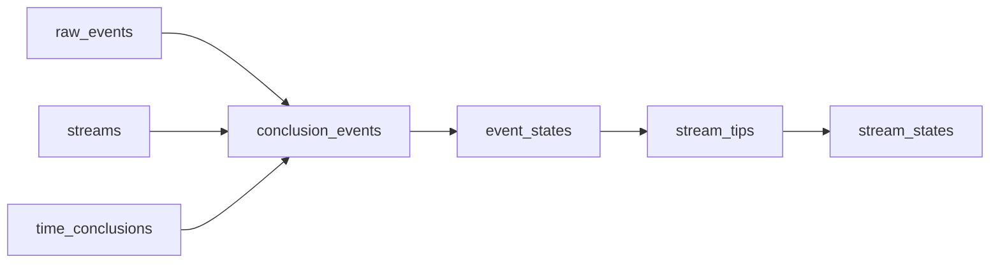

# Pipeline Architecture

The pipeline architecture allows for defining features over Ceramic data as a series of transformations over that data.
What follows is a descriptions of each phase of the ceramic pipeline, the features it enables, and its dependencies.

## Overview

Data enters Ceramic via its API or is discovered over the network and is stored into the raw_events table.
From there various transformations are applied producing various intermediate tables.
Each table schema is considered public API and provides access to arbitrary queries against the data.

## Tables

### raw_events

The raw_events table contains a row for each event in a stream and contains the raw CAR data of the event.

#### Features

* Access to the raw event data that can be used to validate signatures

#### Schema

| Column     | Type  | Description           |
| ------     | ----  | -----------           |
| stream_cid | bytes | Cid of the stream     |
| event_cid  | bytes | Cid of the event      |
| car        | bytes | CAR data of the event |

### streams

The streams table contains a row for each stream and contains the dimensions and controller of the stream.

#### Features

* Access to the identifying information for streams

#### Schema

| Column      | Type              | Description                                                 |
| ------      | ----              | -----------                                                 |
| stream_cid  | bytes             | Cid of the stream                                           |
| stream_type | u8                | Type of the stream, see [stream type values](#stream-types) |
| controller  | string            | Controller of the stream                                    |
| dimensions  | map(string,bytes) | Dimensions of the stream                                    |

### time_conclusions

The time_conclusions table contains a row for each conclusion about a CID existing on chain.

TBD how this table is populated and its schema.

### conclusion_events

The conclusion_events table contains a row for each event in a stream and represents a raw input event after various conclusions have been made.

#### Features

* Access to events allowing in order access to event within stream
* Access to pre-aggregated data for users building their own aggregation system
* Validation of the event signatures
* Validation of timestamp inclusion

#### Schema

| Column                 | Type              | Description                                                                               |
| ------                 | ----              | -----------                                                                               |
| conclusion_event_order | u64               | Order of this event. Value is always greater than any previous event in the same stream   |
| stream_cid             | bytes             | Cid of the stream                                                                         |
| stream_type            | u8                | Type of the stream, see [stream type values](#stream-types)                               |
| controller             | string            | Controller of the stream                                                                  |
| dimensions             | map(string,bytes) | Set of key values dimension pairs of the stream                                           |
| event_cid              | bytes             | Cid of the event                                                                          |
| event_type             | u8                | Type of the event, see [event type values](#event-types)                                  |
| data                   | bytes             | The event payload, content is stream type specific                                        |
| previous               | list(bytes)       | Ordered list of CID previous to this event. Meaning of the order is stream type dependent |

#### Transformation

Raw events are transformed into a flattened structure where stream dimensions and conclusions about data are added to the data.

Conclusions include:

* The event has a valid signature
* The dimensions and controller of the event
* The timestamp of the event

This table joins the raw_events, time_conclusions, and streams tables in order to make the conclusions about the raw events.

### event_states

The event_states table contains a row for each event in a stream and the state of the document at that point in the stream.

#### Features

* Access to the full history of states for a stream
* Validation of the model schema

#### Schema

| Column                 | Type              | Description                                                                                                                                      |
| ------                 | ----              | -----------                                                                                                                                      |
| conclusion_event_order | u64               | Order of this event from the conclusion_events table.                                                                                            |
| event_state_order      | u64               | Order of this event state. Value is always greater than any previous event in the same stream and any dependent streams (i.e. model streams) |
| stream_cid             | bytes             | Cid of the stream                                                                                                                                |
| stream_type            | u8                | Type of the stream, see [stream type values](#stream-types)                                                                                      |
| controller             | string            | Controller of the stream                                                                                                                         |
| dimensions             | map(string,bytes) | Set of key values dimension pairs of the stream                                                                                                  |
| event_cid              | bytes             | Cid of the event                                                                                                                                 |
| event_type             | u8                | Type of the event, see [event type values](#event-types)                                                                                         |
| event_height           | i32               | Number of events between this event and the init event of the stream.                                                                            |
| data                   | bytes             | The event payload, content is stream type specific                                                                                               |
| validation_errors      | list(string)      | List of validation errors, will always be an empty list (not null) when the stream state is valid.                                               |

#### Transformation

This table computes the aggregated state for each conclusion event.
Additionally it validates the aggregated state matches the model schema of the stream.

### stream_tips

The stream_tips table contains a row for each tip of each stream representing the canonical state for each branch of the stream.
The tip represents the most recent event in each branch of the stream, where _recent_ is a stream type specific definition.

#### Features

* Access to the multiple tips of streams for users building their own conflict resolution

#### Schema

| Column            | Type              | Description                                                                           |
| ------            | ----              | -----------                                                                           |
| event_state_order | u64               | Order of this event from the event_states table.                                      |
| stream_tip_order  | u64               | Order of this stream tips. Value is always greater than any previous stream tips set. |
| stream_cid        | bytes             | Cid of the stream                                                                     |
| stream_type       | u8                | Type of the stream, see [stream type values](#stream-types)                           |
| controller        | string            | Controller of the stream                                                              |
| dimensions        | map(string,bytes) | Set of key values dimension pairs of the stream                                       |
| tips              | list(bytes)       | Complete list of all tips for the stream.                                             |

#### Transformation

This table computes the aggregated state for each conclusion event.
Additionally it validates the aggregated state matches the model schema of the stream.

### stream_states

The stream_states table contains a row for each stream representing the canonical state of the stream.

#### Features

* Access to canonical state of streams for users relying on built in conflict resolution

#### Schema

| Column             | Type              | Description                                                                                        |
| ------             | ----              | -----------                                                                                        |
| stream_tip_order   | u64               | Order of this event from the stream_tips table.                                                    |
| stream_state_order | u64               | Order of this stream state. Value is always greater than any previous stream state.                |
| stream_cid         | bytes             | Cid of the stream                                                                                  |
| stream_type        | u8                | Type of the stream, see [stream type values](#stream-types)                                        |
| controller         | string            | Controller of the stream                                                                           |
| dimensions         | map(string,bytes) | Set of key values dimension pairs of the stream                                                    |
| event_cid          | bytes             | Cid of the event                                                                                   |
| event_type         | u8                | Type of the event, see [event type values](#event-types)                                           |
| event_height       | i32               | Number of events between this event and the init event of the stream.                              |
| data               | bytes             | The event payload, content is stream type specific                                                 |

#### Transformation

Computes the singular tip that is the canonical state of the stream.

## Stream Types

The pipeline process varies by stream type.
Each loadable stream type defines:

* the content of the event payload,
* the rules for validating an event
* the rules for determining a canonical tip for a stream

| Name                    | Code | Description                                                | Specification                                                                                       |
| ----                    | ---- | -----------                                                | -------------                                                                                       |
| Tile                    | 0x00 | (Deprecated) A stream type representing a json document    | https://cips.ceramic.network/CIPs/cip-8                                                             |
| CAIP-10 Link            | 0x01 | (Deprecated) Link blockchain accounts to DIDs              | https://cips.ceramic.network/CIPs/cip-7                                                             |
| Model                   | 0x02 | Defines a schema shared by group of documents in ComposeDB | https://github.com/ceramicnetwork/js-ceramic/tree/main/packages/stream-model                        |
| Model Instance Document | 0x03 | Represents a json document in ComposeDB                    | https://github.com/ceramicnetwork/js-ceramic/tree/main/packages/stream-model-instance               |
| UNLOADABLE              | 0x04 | A stream that is not meant to be loaded                    | https://github.com/ceramicnetwork/js-ceramic/blob/main/packages/stream-model/src/model.ts#L163-L165 |
| EventId                 | 0x05 | An event id encoded as a cip-124 EventID. Also unloadable  | https://cips.ceramic.network/CIPs/cip-124                                                           |

Source https://cips.ceramic.network/CIPs/cip-59#streamid-multicodec

### Model

Model streams represent the definition of a composable model.

The content of a model stream payload is a DAG-JSON description of its schema.
Models are immutable and updates to the stream are not supported.
Therefore the canonical tip for a model stream is always the init event.

### Model Instance Document

Model instance document streams represent an instance of a model defined via a model stream.
An instance must conform to the schema definition of the model.

The content of a model instance document event payload is a DAG-JSON encoding of a JSON PATCH document.
The stream state is determined by applying the JSON patches in sequence.

The canonical tip for a stream follows these rules:

TODO(https://github.com/ceramicnetwork/rust-ceramic/issues/588) write out rules

## Event Types

| Name | Code | Description                                      |
| ---- | ---- | -----------                                      |
| Data | 0x00 | An event containing data for the stream          |
| Time | 0x01 | An event about the temporal status of the stream |
