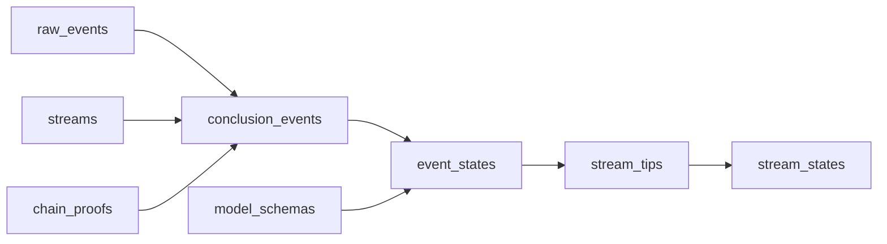

# Pipeline Architecture

The pipeline architecture allows for defining features over Ceramic data as a series of transformations over that data.
What follows is a descriptions of each phase of the ceramic pipeline the features it enables and its dependencies.

## Overview

Data enters Ceramic via its API and is stored into the raw_events table.
From there various transformations are applied producing various intermediate tables.
Each table schema is considered public API and provides access to kind of query pattern against the data.

## raw_events

The raw_events table contains a row for each event in a stream and contains the raw CAR data of the event.

### Features

* Access to the raw event data that can be used to validate signatures

### Schema

| Column     | Type  | Description           |
| ------     | ----  | -----------           |
| stream_cid | bytes | Cid of the stream     |
| event_cid  | bytes | Cid of the event      |
| car        | bytes | CAR data of the event |

## streams

The streams table contains a row for each stream and contains the dimensions and controller of the stream.

### Features

* Access to the identifying information for streams

### Schema

| Column      | Type              | Description                                                 |
| ------      | ----              | -----------                                                 |
| stream_cid  | bytes             | Cid of the stream                                           |
| stream_type | u8                | Type of the stream, see [stream type values](#stream-types) |
| controller  | string            | Controller of the stream                                    |
| dimensions  | map(string,bytes) | Dimensions of the stream                                    |

## chain_proofs

The chain_proofs table contains a row for each on chain proof.

TBD how this table is populated and its schema.

## conclusion_events

The conclusion_events table contains a row for each event in a stream and represents a raw input event after various conclusions have been made.

### Features

* Access to events allowing in order access to event within stream
* Access to pre-aggregated data for users building their own aggregation system
* Validation of the event signatures

### Schema

| Column      | Type              | Description                                                                                     |
| ------      | ----              | -----------                                                                                     |
| index       | u64               | Order of this event. Index is always greater than the index of any previous event in the stream |
| stream_cid  | bytes             | Cid of the stream                                                                               |
| stream_type | u8                | Type of the stream, see [stream type values](#stream-types)                                     |
| controller  | string            | Controller of the stream                                                                        |
| dimensions  | map(string,bytes) | Set of key values dimension pairs of the stream                                                 |
| event_cid   | bytes             | Cid of the event                                                                                |
| event_type  | u8                | Type of the event, see [event type values](#event-types)                                        |
| data        | bytes             | DAG-JSON encoding of the event payload                                                          |
| previous    | list(bytes)       | Ordered list of CID previous to this event. Meaning of the order is stream type dependent       |

### Transformation

Raw events are transformed into a flattened structure where stream dimensions and conclusions about data are added to the data.

Conclusions include:

* The event has a valid signature
* The dimensions and controller of the event

This table joins the raw_events, chain_proofs, and streams tables in order to make the conclusions about the raw events.

## model_schemas

The model_schemas table contains a row for each model and contains the complete resolved schema of the model.

TBD how this table is populated and its schema.
This table may be able to be combined with the streams table. Should we?

## event_states

The event_states table contains a row for each event in a stream and the state of the document at that point in the stream.

### Features

* Access to the full history of states for a stream
* Validation of the model schema

### Schema

| Column      | Type              | Description                                                                                     |
| ------      | ----              | -----------                                                                                     |
| index       | u64               | Order of this event. Index is always greater than the index of any previous event in the stream |
| stream_cid  | bytes             | Cid of the stream                                                                               |
| stream_type | u8                | Type of the stream, see [stream type values](#stream-types)                                     |
| controller  | string            | Controller of the stream                                                                        |
| dimensions  | map(string,bytes) | Set of key values dimension pairs of the stream                                                 |
| event_cid   | bytes             | Cid of the event                                                                                |
| event_type  | u8                | Type of the event, see [event type values](#event-types)                                        |
| state       | bytes             | JSON encoding of the event state                                                                |

### Transformation

This table computes the aggregated state for each conclusion event.
Additionally it validates the aggregated state matches the model schema of the stream.

## stream_tips

The stream_states table contains a row for head of each stream representing the canonical state of the stream tips.

### Features

* Access to the multiple tips of streams for users building their on conflict resolution

### Schema

| Column      | Type              | Description                                                                                     |
| ------      | ----              | -----------                                                                                     |
| index       | u64               | Order of this event. Index is always greater than the index of any previous event in the stream |
| stream_cid  | bytes             | Cid of the stream                                                                               |
| stream_type | u8                | Type of the stream, see [stream type values](#stream-types)                                     |
| controller  | string            | Controller of the stream                                                                        |
| dimensions  | map(string,bytes) | Set of key values dimension pairs of the stream                                                 |
| event_cid   | bytes             | Cid of the event                                                                                |
| event_type  | u8                | Type of the event, see [event type values](#event-types)                                        |
| state       | bytes             | JSON encoding of the event state                                                                |

### Transformation

Computes the unique tips of a stream. Old tips are deleted or deprecated behind a version commit or similar.

## stream_states

The stream_states table contains a row for each stream representing the canonical state of the stream.

### Features

* Access to canonical state of streams for users relying on built in conflict resolution

### Schema

| Column      | Type              | Description                                                                                     |
| ------      | ----              | -----------                                                                                     |
| index       | u64               | Order of this event. Index is always greater than the index of any previous event in the stream |
| stream_cid  | bytes             | Cid of the stream                                                                               |
| stream_type | u8                | Type of the stream, see [stream type values](#stream-types)                                     |
| controller  | string            | Controller of the stream                                                                        |
| dimensions  | map(string,bytes) | Set of key values dimension pairs of the stream                                                 |
| event_cid   | bytes             | Cid of the event                                                                                |
| event_type  | u8                | Type of the event, see [event type values](#event-types)                                        |
| state       | bytes             | JSON encoding of the event state                                                                |

### Transformation

Computes the singular head that is the canonical state of the stream.

## Enumeration Values

### Stream Types

| name                    | code | description                                                | specification                                                                                       |
| ----                    | ---- | -----------                                                | -------------                                                                                       |
| Tile                    | 0x00 | A stream type representing a json document                 | https://cips.ceramic.network/CIPs/cip-8                                                             |
| CAIP-10 Link            | 0x01 | Link blockchain accounts to DIDs                           | https://cips.ceramic.network/CIPs/cip-7                                                             |
| Model                   | 0x02 | Defines a schema shared by group of documents in ComposeDB | https://github.com/ceramicnetwork/js-ceramic/tree/main/packages/stream-model                        |
| Model Instance Document | 0x03 | Represents a json document in ComposeDB                    | https://github.com/ceramicnetwork/js-ceramic/tree/main/packages/stream-model-instance               |
| UNLOADABLE              | 0x04 | A stream that is not meant to be loaded                    | https://github.com/ceramicnetwork/js-ceramic/blob/main/packages/stream-model/src/model.ts#L163-L165 |
| EventId                 | 0x05 | An event id encoded as a cip-124 EventID                   | https://cips.ceramic.network/CIPs/cip-124                                                           |

Source https://cips.ceramic.network/CIPs/cip-59#streamid-multicodec

### Event Types

| name | code | description                                      |
| ---- | ---- | -----------                                      |
| Data | 0x00 | An event containing data for the stream          |
| Time | 0x01 | An event about the temporal status of the stream |
